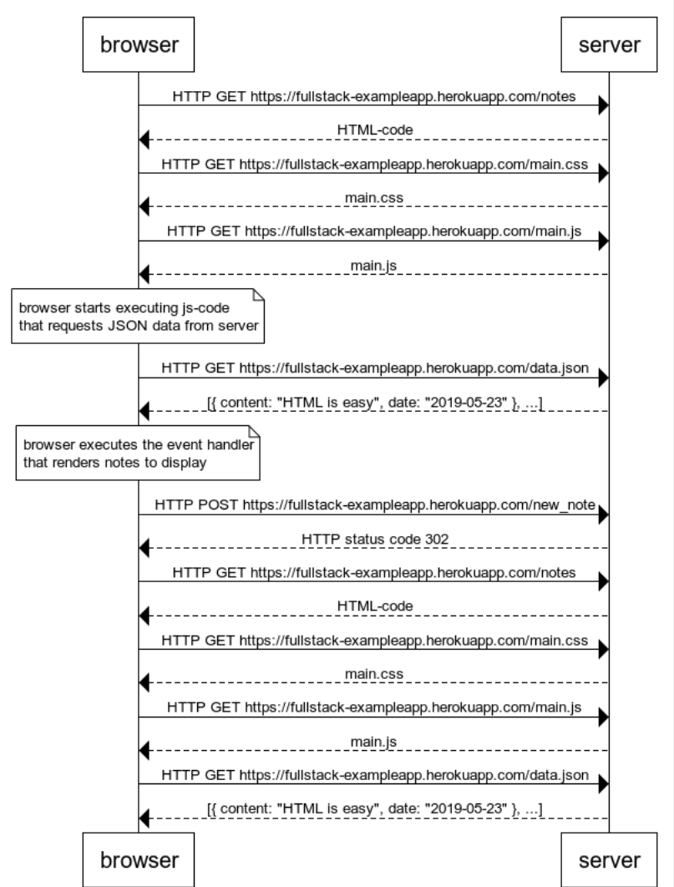
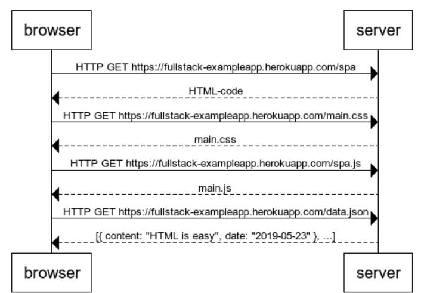
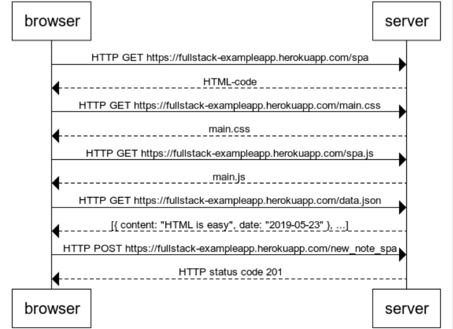

# Part 0 Exercises

## 0.1: HTML

### Review the basics of HTML by reading this tutorial from Mozilla: [HTML tutorial](https://developer.mozilla.org/en-US/docs/Learn/Getting_started_with_the_web/HTML_basics)

Done.

## 0.2: CSS

### Review the basics of CSS by reading this tutorial from Mozilla [CSS tutorial](https://developer.mozilla.org/en-US/docs/Learn/Getting_started_with_the_web/CSS_basics)

Done.

## 0.3: HTML forms

### Learn about the basics of HTML forms by reading Mozilla's tutorial [Your first form](https://developer.mozilla.org/en-US/docs/Learn/Forms/Your_first_form)

Done.

## 0.4 new note

### Create a similar diagram depicting the situation where the user creates a new note on page [https://fullstack-exampleapp.herokuapp.com/notes](https://fullstack-exampleapp.herokuapp.com/notes) by writing something into the text field and clicking the submit button. If necessary, show operations on the browser or on the server as comments on the diagram

In a traditional web app, posting data to the webserver causes the webpage to update after the web server responds with a status code 302. In this case, it means that the browser if forced to fetch the HTML code again, which links to a stylesheet, a JavaScript script, and JSON data. A fetch has to be issued for each of these external links in the the HTML.

## 0.5 Single page app

### Create a diagram depicting the situation where the user goes to the [single page app](https://fullstackopen.com/en/part0/fundamentals_of_web_apps#single-page-app) version of the notes app at [https://fullstack-exampleapp.herokuapp.com/spa](https://fullstack-exampleapp.herokuapp.com/spa)

A single page app is similar to a traditional web app on initial load (though the initial load takes longer). It still sends an http request to the web server, gets the HTML response. From the html response it fires off three more GET requests because of the CSS, JS, and JSON references in the HTML.  

## 0.6 New note

### Create a diagram depicting the situation where a user creates a new note using the single page version of the app

In a single page web app, when the browser sends an HTTP POST and the web server responds with a successful status code, the browser doesn't need to issue an HTTP GET to update the page. The JavaScript code suppresses the default behavior of the submit element (which would send data to the server and cause a redirect), and instead pushes the new note itself directly to the list of notes.  

